# TRD - Habit Heatmap MVP

## 1. Scope Alignment
This TRD maps directly to PRD acceptance criteria `12.1` through `12.14`.

Notes on PRD conflicts:
- `12.14 Share` is marked in PRD as "not MVP scope". It is documented here as a deferred design with no implementation in MVP.
- `12.7 Streak Goal` is also marked in functional scope text as not MVP, but appears in acceptance criteria. To satisfy acceptance traceability, this TRD includes persistence/display support for streak goal selection.

## 2. Architecture Baseline
- Frontend: mobile-first PWA built with vanilla JavaScript modules (no frontend framework).
- Hosting: Cloudflare Pages (static assets).
- Local data: IndexedDB (primary), localStorage (UI preferences only).
- Offline: Service Worker with app shell and static asset caching.
- No auth, no cloud sync, no remote habit data storage.

Core entities:
- `Habit`: id, name, description, iconType, iconValue, color, archived, createdAt, updatedAt, streakGoalInterval, trackingType, targetPerDay, unitLabel.
- `Category`: id, name, iconType, iconValue, isSystem, createdAt.
- `Completion`: id, habitId, dateLocal, value, createdAt, updatedAt.
- `Reminder` (local capability model): id, habitId, time, enabled, deliverySupport.

Derived read models:
- `DailyProgress(habitId, dateLocal) = sum(completion.value)`.
- `HeatmapCellState` from progress ratio: `0`, `low`, `medium`, `full`.

## 3. Stack
- Runtime/Language: Vanilla JavaScript (ES modules) on modern mobile browsers.
- UI Architecture: framework-free component pattern using reusable template/render functions.
- Build Tooling: Vite (or equivalent static bundler) for asset bundling and Cloudflare Pages output.
- Styling: Primer CSS (GitHub design system) for base UI patterns + small custom CSS for heatmap cells, dark theme tuning, and mobile-specific layout details.
- PWA Layer: `manifest.webmanifest` + native Service Worker for installability and offline app-shell caching.
- Client Data: native IndexedDB as the primary persistence layer; localStorage only for lightweight UI preferences.
- Date/Time: native `Date` with strict local-date keying (`YYYY-MM-DD`) to avoid UTC bucket drift.
- Icons/Emoji: SVG icon set (local assets) plus native emoji rendering for the dual picker model.
- Sharing Path (deferred): `html-to-image`/Canvas snapshot + Web Share API with download fallback (design only for MVP).
- Deployment: Cloudflare Pages for static hosting; optional Cloudflare Worker only for reminder delivery mechanics where supported, never for habit data storage.
- Testing: framework-agnostic unit tests (if added) plus Playwright mobile viewport tests for acceptance flows.

## 4. Acceptance Criteria Design

### 12.1 App Structure
Design:
- `manifest.webmanifest` + install icons + theme color.
- Service worker registration on app bootstrap.
- Cloudflare Pages deploy target with static bundle.
- No auth routes/components.
- No sync client/service endpoints.

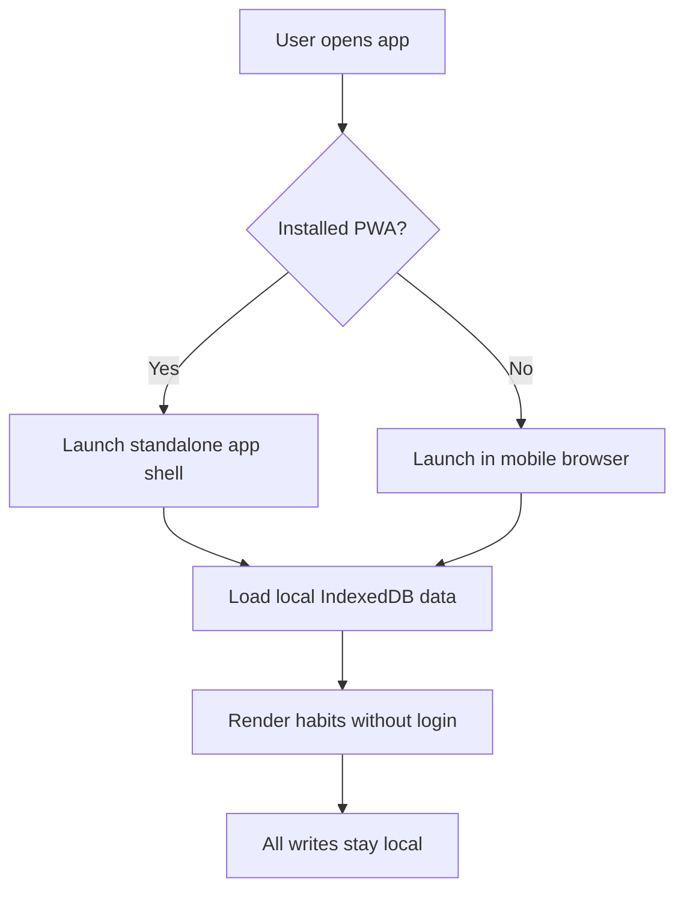

### 12.2 Empty State
Design:
- Empty state shown when `activeHabits.count == 0`.
- Two triggers route to same create habit modal: central CTA and plus button.

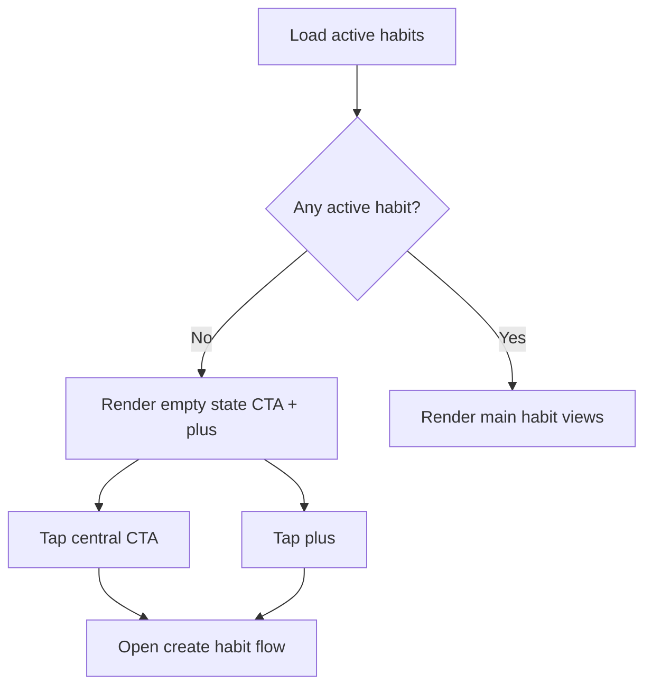

### 12.3 Create Habit
Design:
- Form fields: name, icon/emoji selector, color (required); description/categories/reminder/etc optional.
- Validation gate controls Save enabled state.
- On save: insert habit into IndexedDB, refresh in-memory store, render card immediately.

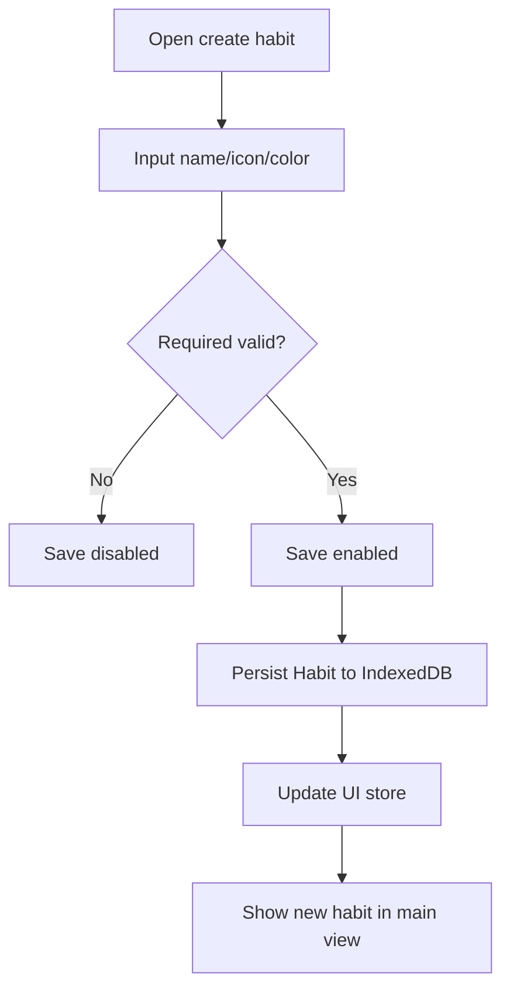

### 12.4 Edit Habit
Design:
- Edit screen preloads existing habit values.
- Save writes update transaction in IndexedDB.
- Post-save rehydrates store from update result; persisted values survive refresh.

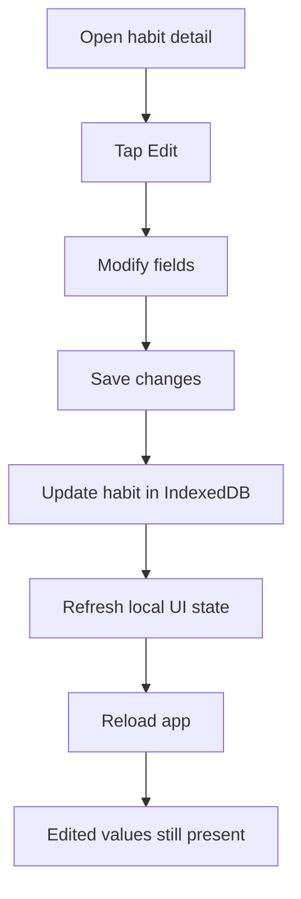

### 12.5 Icon and Emoji Picker
Design:
- Bottom sheet picker with segmented tabs `Icon | Emoji`.
- Search filter applied to currently selected tab dataset.
- Selected value updates form preview and habit card/icon tile.

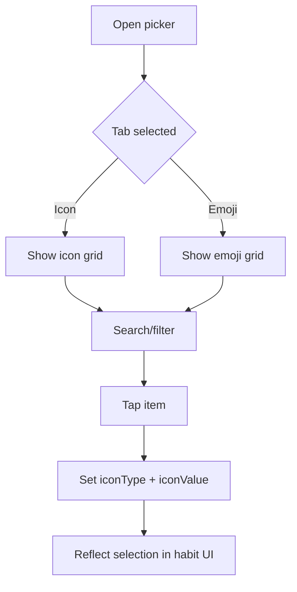

### 12.6 Categories
Design:
- Multi-select categories in selector modal.
- "Create category" path: name + icon required.
- New category written to IndexedDB then immediately available in selection list for current/future habits.

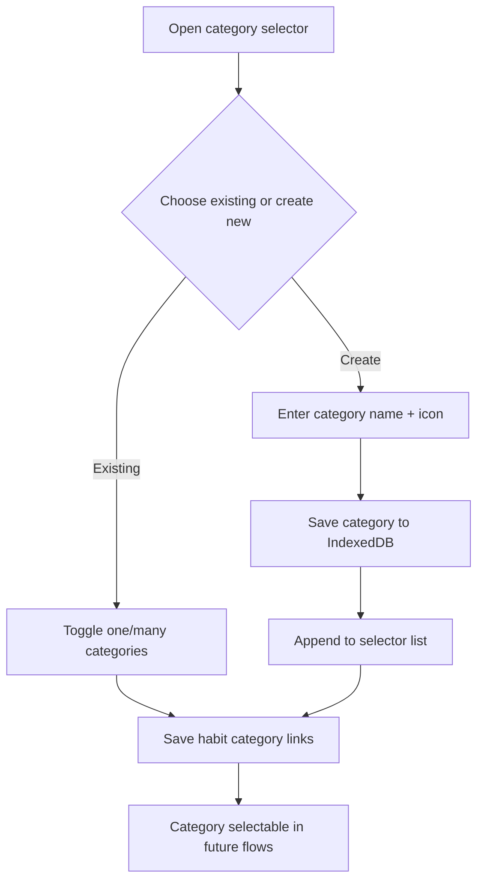

### 12.7 Streak Goal
Design:
- Persist enum `none|daily|weekly|monthly` on Habit.
- Streak goal selector in create/edit.
- Show selected goal badge in detail view.
- Calculation logic can remain minimal for MVP if only selection persistence/display is required.

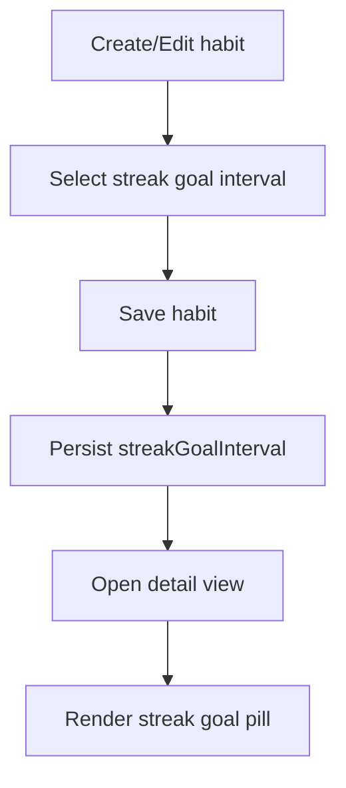

### 12.8 Completion Modes
Design:
- Mode selector: `step` or `custom`.
- `targetPerDay` required positive integer.
- Progress calculation:
  - Step mode entries contribute value `1` each.
  - Custom mode entries contribute user numeric value.
- Daily progress ratio drives heatmap state.

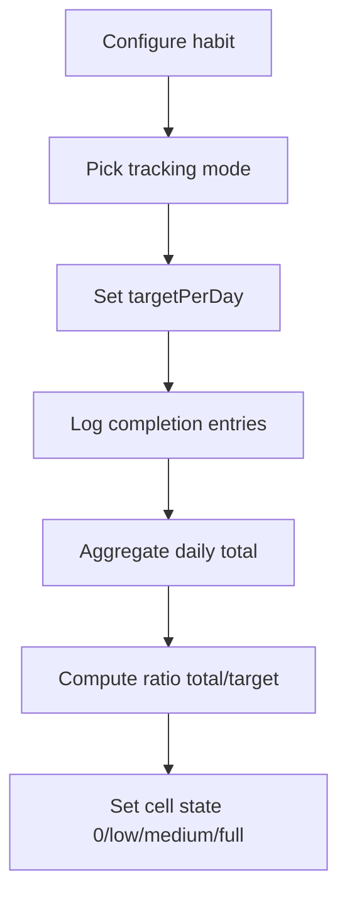

### 12.9 Single Entry Habit
Design:
- For `targetPerDay = 1`, card action is single-tap complete.
- Action writes completion for today local date.
- UI store updates instantly; heatmap current cell rerenders in same frame budget.

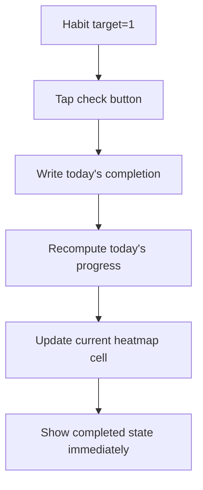

### 12.10 Counted Habit
Design:
- For `targetPerDay > 1`, card action increments progress (or opens quick input for custom values).
- Each entry updates daily aggregate.
- Heatmap transitions through partial and full intensity states.

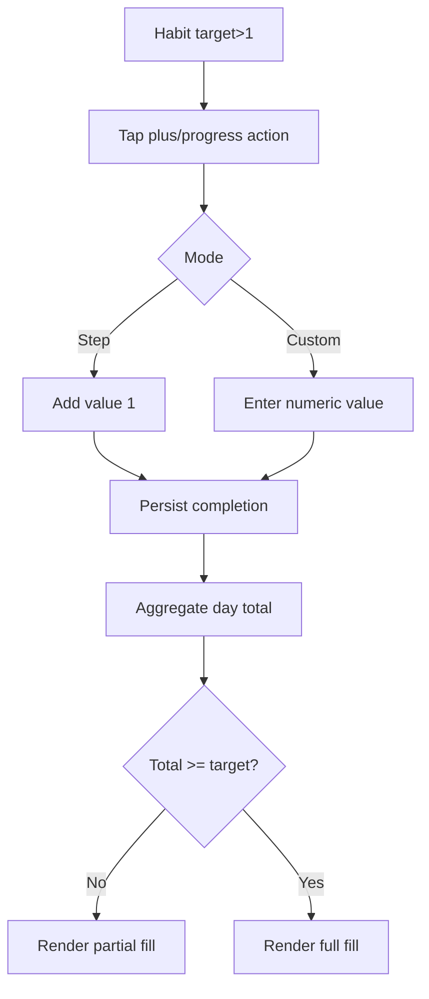

### 12.11 Heatmap
Design:
- Compact heatmap on main card, expanded heatmap in detail.
- Expanded view includes month headers and weekday labels.
- Cell color derives from habit color palette with intensity tiers.
- Zero-progress days use muted baseline tone.

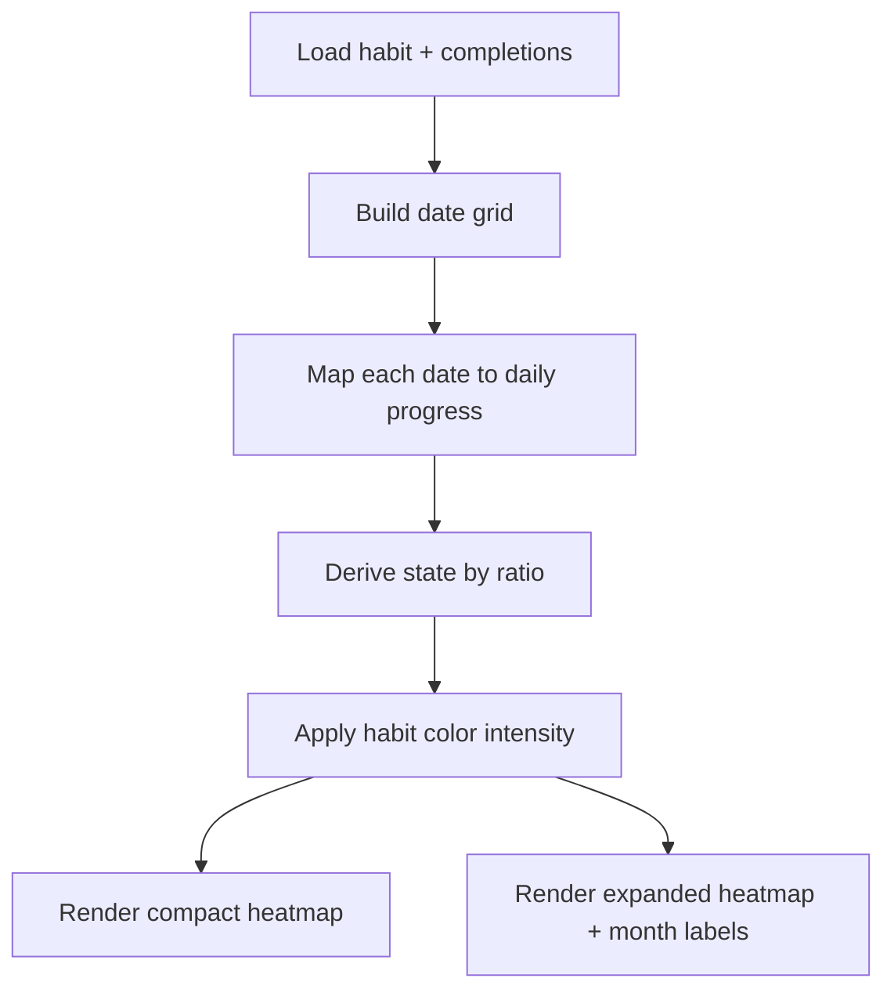

### 12.12 Detail View
Design:
- Opening a habit presents detail modal/page containing:
  - large heatmap
  - month calendar
  - edit action
  - overflow menu with archive/share entries
- Detail receives live updates from the same local store as main views.

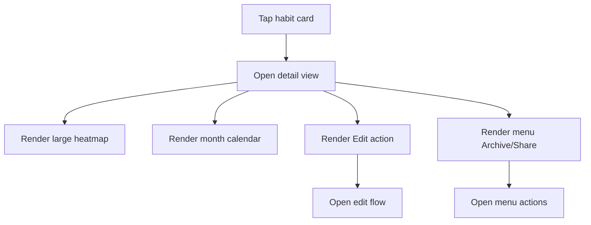

### 12.13 Archive
Design:
- Archive action toggles `habit.archived = true`.
- Active queries filter `archived = false`.
- Archived list reads `archived = true` from same local DB.
- Completion history remains untouched.

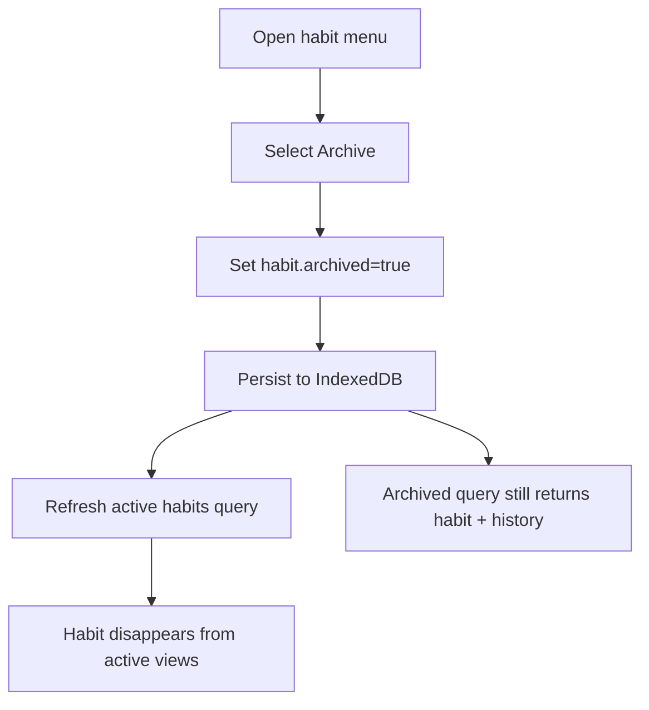

### 12.14 Share (Deferred in MVP)
Design (documented, not implemented in MVP):
- Generate card snapshot from habit detail.
- Attempt Web Share API with image payload when supported.
- Fallback to download/export image.

MVP decision:
- Keep menu entry optional/hidden behind feature flag until implementation phase.
- Acceptance can only be claimed after implementation; this TRD only defines technical path.

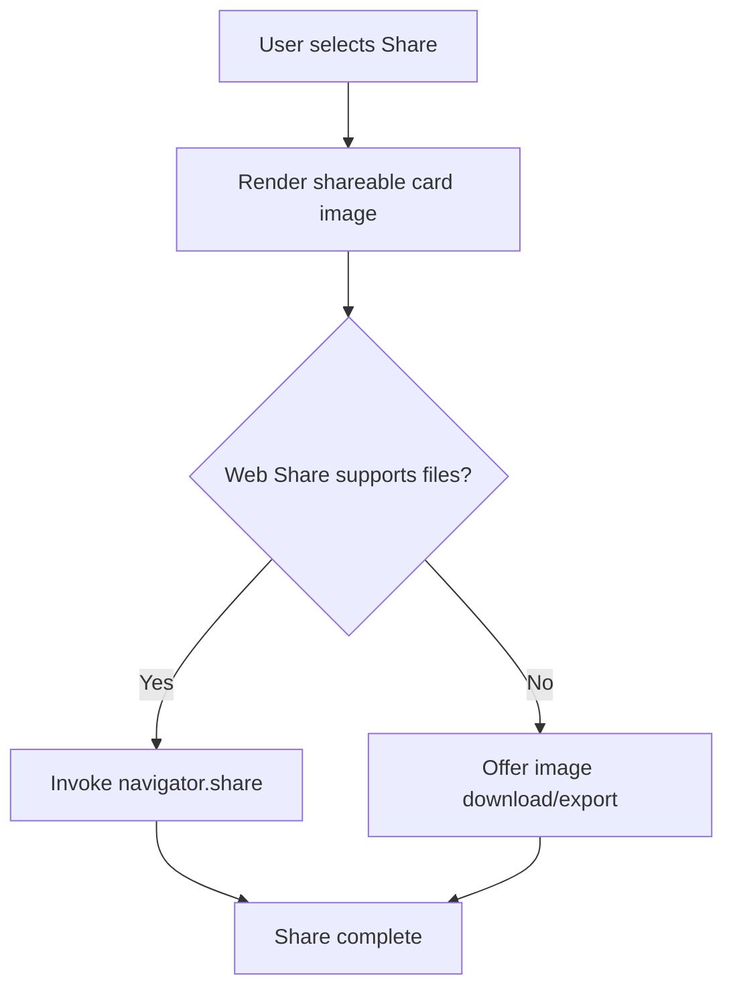

## 5. Cross-Cutting Technical Decisions
- Date handling: local date keys (`YYYY-MM-DD` in device locale context) to avoid UTC day shifts.
- State model: optimistic local updates first, DB commit second, rollback only on hard failure.
- Performance target: completion action to visible UI update under 100 ms.
- Accessibility: icon-only actions include aria-labels; color states not solely color-dependent when possible.

## 6. Non-Implementation Deliverable Boundary
This document is design-only and intentionally excludes implementation tasks, migrations, and source code changes.
